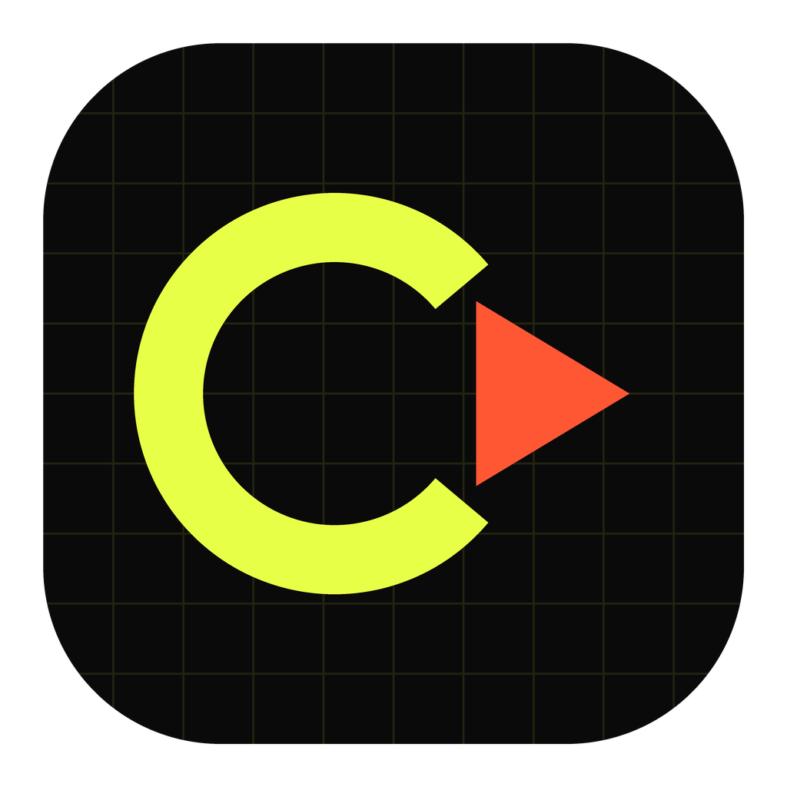

# CONVRT Vídeo — app de macOS

App nativo (SwiftUI) que converte vídeo de câmera antiga para MP4. Roda offline,
não fala com servidor nenhum, e o arquivo original nunca é apagado.

> **Nunca usou Xcode?** Vá direto para o **[PASSO-A-PASSO.md](PASSO-A-PASSO.md)**:
> guia do zero, com Finder e Xcode apenas, sem digitar nada no Terminal.
>
> **No Xcode 26 (beta ou não)?** Tem um passo extra obrigatório sobre isolamento
> de concorrência — é o passo 6c do guia acima, ou veja "Problemas comuns" logo
> abaixo se já estiver com erro de compilação citando "actor".



## O que ele converte

Formatos que os camcorders e celulares antigos gravavam e que hoje quase nada abre:

| Origem | Onde aparece |
| --- | --- |
| `.MOD`, `.TOD`, `.VRO` | camcorder JVC/Panasonic/Canon de HDD e DVD |
| `.MTS`, `.M2TS`, `.M2T` | AVCHD (Sony, Panasonic, Canon HD) |
| `.VOB`, `.MPG`, `.MPEG`, `.M2V` | DVD e camcorder de DVD |
| `.DV`, `.DIF`, `.AVI` | MiniDV, câmeras digitais dos anos 2000 |
| `.3GP`, `.3G2`, `.AMV` | celular antigo |
| `.WMV`, `.ASF`, `.RM`, `.RMVB`, `.FLV` | vídeo de PC e web antigos |
| `.MKV`, `.WEBM`, `.MOV`, `.MP4`, `.MXF` | formatos atuais (recomprimir/normalizar) |

Saída: **MP4 (H.264 ou H.265) + áudio AAC**, com `faststart`.

## Por que não dá pra fazer isso no app web

Converter vídeo no navegador exigiria carregar o ffmpeg compilado em WebAssembly
(dezenas de MB), que é várias vezes mais lento, não usa aceleração de hardware e
não abre boa parte dos formatos antigos. Nativo é a ferramenta certa aqui.

## Recursos

- **fila em lote**: arraste uma pasta inteira; converte um vídeo por vez (o ffmpeg
  já usa todos os núcleos) com progresso real por arquivo
- **desentrelaçamento automático** — detecta pelo `field_order` do arquivo. É o que
  tira as listras horizontais típicas de MiniDV/AVCHD em cenas com movimento
- **correção de proporção** — conserta o vídeo espremido/esticado de origens com
  pixel não quadrado (DV 4:3, VOB)
- **presets**: compatibilidade máxima, melhor qualidade, menor arquivo (H.265),
  rápido por GPU (VideoToolbox) e "só trocar o invólucro" (sem recodificar)
- **rotação**, limite de resolução, CRF ajustável, taxa do áudio
- **mantém a data de gravação original** (senão o Fotos/Finder joga tudo pra hoje)
- **mostra o comando ffmpeg** que será executado — nada de caixa-preta
- nunca sobrescreve: se já existir um `ferias.mp4`, gera `ferias-2.mp4`

## Instalação

### 1. O motor: ffmpeg

O app usa o `ffmpeg` para decodificar. Três caminhos, em ordem de simplicidade:

```bash
brew install ffmpeg                    # o app acha sozinho depois disso
```

```bash
./scripts/fetch-ffmpeg.sh              # embute uma cópia dentro do app
./scripts/fetch-ffmpeg.sh --do-sistema # copia o que já está instalado
```

Ou aponte o caminho manualmente na própria tela do app.

### 2. Compilar

**Com XcodeGen (recomendado):**

```bash
brew install xcodegen
./scripts/build.sh --abrir     # gera o .xcodeproj e abre no Xcode (⌘R para rodar)
./scripts/build.sh             # ou compila direto em build/ConvrtVideo.app
```

**Sem instalar nada além das ferramentas de linha de comando:**

```bash
./scripts/build-sem-xcode.sh --abrir
```

**Direto no Xcode, sem scripts:**

1. novo projeto → macOS → App (SwiftUI, Swift, deployment target 13.0)
2. apague o `ContentView.swift` e o `<Nome>App.swift` que o Xcode criou
3. arraste a pasta `ConvrtVideo/` para o navegador do projeto e, na janela que
   abre, marque **Create groups** (não "folder references") e **deixe o target
   `ConvrtVideo` marcado** em *Add to targets* — é aqui que quase todo mundo
   escorrega; sem o target marcado os arquivos não compilam e o Xcode reclama de
   "Cannot find ... in scope"
4. confira em *Build Phases → Compile Sources* que estão lá os 11 arquivos `.swift`
5. em *Signing & Capabilities*, remova o **App Sandbox** — sem isso o app não
   consegue executar o ffmpeg

## Como usar

1. Arraste os vídeos (ou uma pasta) para a janela
2. Escolha o preset à direita — se estiver em dúvida, deixe em *Compatibilidade máxima*
3. **Converter tudo** (⌘Return)
4. Quando terminar, o botão da pasta abre o arquivo no Finder

Dica para material antigo: mantenha *Desentrelaçar: automático* e *Corrigir
proporção* ligados. São eles que transformam um MTS de 2007 num MP4 que parece
normal no iPhone.

## Estrutura do código

```
ConvrtVideo/
  ConvrtVideoApp.swift          entrada do app, menus e painéis de arquivo
  Models/
    MediaInfo.swift             o que o ffprobe descobriu do arquivo
    ConversionSettings.swift    presets e a montagem dos argumentos do ffmpeg
    VideoJob.swift              um item da fila
  Services/
    FFmpegLocator.swift         acha o ffmpeg (bundle > escolha do usuário > Homebrew)
    FFmpegRunner.swift          executa e lê o progresso de `-progress pipe:1`
    ConversionQueue.swift       orquestra a fila
  Views/
    ContentView.swift           janela principal e arrastar-e-soltar
    LinhaDoVideo.swift          linha da fila
    PainelDeAjustes.swift       painel lateral de opções
    TelaDeInstalacao.swift      tela que aparece quando falta o ffmpeg
  Resources/
    Info.plist                  identidade do app
    ConvrtVideo.entitlements    permissões (sandbox desligada)
    AppIcon.icns                ícone, usado pelos scripts de build
    AppIcon-1024.png            mesma arte, para arrastar no Assets.xcassets
```

O ícone é gerado por `scripts/gerar-icone.py` (precisa de Pillow) — mexa lá se
quiser mudar o desenho.

A lógica que decide *o que* o ffmpeg vai fazer está toda em
`ConversionSettings.filtros(para:)` e `.argumentos(entrada:saida:info:)` — é lá que
se mexe para ajustar a conversão.

## Sobre a caixa de areia (App Sandbox)

O app roda com sandbox **desligada**, porque a caixa de areia do macOS impede um
app de executar binários de fora do bundle (o `ffmpeg` do Homebrew). Isso é
aceitável para um app pessoal compilado por você. Se um dia quiser publicar na
App Store, seria preciso embutir o ffmpeg no bundle e reativar a sandbox — e aí
entra também a questão de licença GPL dos codecs.

## Problemas comuns

### "Cannot find 'ConversionQueue' in scope" (ou qualquer outro tipo do app)

O código está certo — o que falta é o Xcode saber que os arquivos existem.
Isso acontece quando a pasta `ConvrtVideo/` foi arrastada para um projeto novo
sem marcar o target, ou entrou como *folder reference* (pasta azul) em vez de
grupo (pasta amarela). Arquivo que não está no target não é compilado, então o
`ConvrtVideoApp.swift` fica sozinho e não enxerga o resto.

**Como conferir:** projeto → target `ConvrtVideo` → aba **Build Phases** →
**Compile Sources**. Precisa ter os 11 arquivos:

```
ConvrtVideoApp.swift
Models/ConversionSettings.swift      Services/ConversionQueue.swift
Models/MediaInfo.swift               Services/FFmpegLocator.swift
Models/VideoJob.swift                Services/FFmpegRunner.swift
Views/ContentView.swift              Views/PainelDeAjustes.swift
Views/LinhaDoVideo.swift             Views/TelaDeInstalacao.swift
```

**Como resolver:**

1. o jeito rápido de descobrir se é só isso — compile fora do Xcode:
   `./scripts/build-sem-xcode.sh` acha os arquivos sozinho. Se compilar aqui,
   o problema é mesmo a montagem do projeto.
2. no projeto aberto: clique no **+** em *Compile Sources* e adicione os que
   faltam; ou apague a referência da pasta e arraste de novo marcando
   **Add to targets: ConvrtVideo** e **Create groups**.
3. o jeito que não erra: `brew install xcodegen && ./scripts/build.sh --abrir`
   — o `project.yml` já lista tudo e o projeto sai pronto.

### "ffmpeg não encontrado" mesmo com o Homebrew instalado

O app procura em `/opt/homebrew/bin`, `/usr/local/bin`, `/opt/local/bin` e
`/usr/bin`. Se o seu está em outro lugar, use o botão *Escolher o arquivo
ffmpeg…* na tela de instalação — o caminho fica salvo.

### O app abre mas não converte nada / erro de permissão

Confirme que o **App Sandbox** está desligado em *Signing & Capabilities*. Com a
caixa de areia ligada o app não consegue executar o ffmpeg de fora do bundle.

### Erro de compilação citando "actor" ou "MainActor" (Xcode 26+)

O Xcode 26 passa a marcar projetos novos com **Default Actor Isolation:
MainActor**, que trata toda classe como presa à thread principal por padrão.
Este app gerencia threads na mão (`DispatchQueue.global` para o ffmpeg,
`DispatchQueue.main` para atualizar a tela) e não foi auditado para esse modo.

**Se você montou o projeto pelo assistente do Xcode:** target → **Build
Settings** → busque **Default Actor Isolation** → troque de **MainActor**
para **Nonisolated**. Busque também **Approachable Concurrency** e deixe em
**No**, se existir.

**Se você usa `./scripts/build.sh` (XcodeGen):** já está resolvido — o
`project.yml` fixa `SWIFT_DEFAULT_ACTOR_ISOLATION: nonisolated`.

**Se você usa `./scripts/build-sem-xcode.sh`:** também já está resolvido, via
`-swift-version 5` explícito no `swiftc`.

### "O app está danificado" ao abrir o .app compilado

Assinatura ad-hoc: `codesign --force --deep --sign - build/ConvrtVideo.app`
(os scripts já fazem isso, mas o Gatekeeper às vezes reclama na primeira vez —
clique com o botão direito → Abrir).

## Estado deste código

Escrito e revisado linha a linha, mas **não compilado**: foi produzido num
ambiente Linux, sem Xcode nem SDK da Apple. Se o compilador reclamar de alguma
coisa na primeira build, deve ser algo pontual (um import, uma assinatura de API),
não a estrutura. O app web na raiz do repositório, esse sim, foi testado de ponta
a ponta num navegador real.

## Licença

MIT, igual ao resto do repositório. O ffmpeg tem licença própria (LGPL/GPL
conforme a build) — veja https://ffmpeg.org/legal.html
